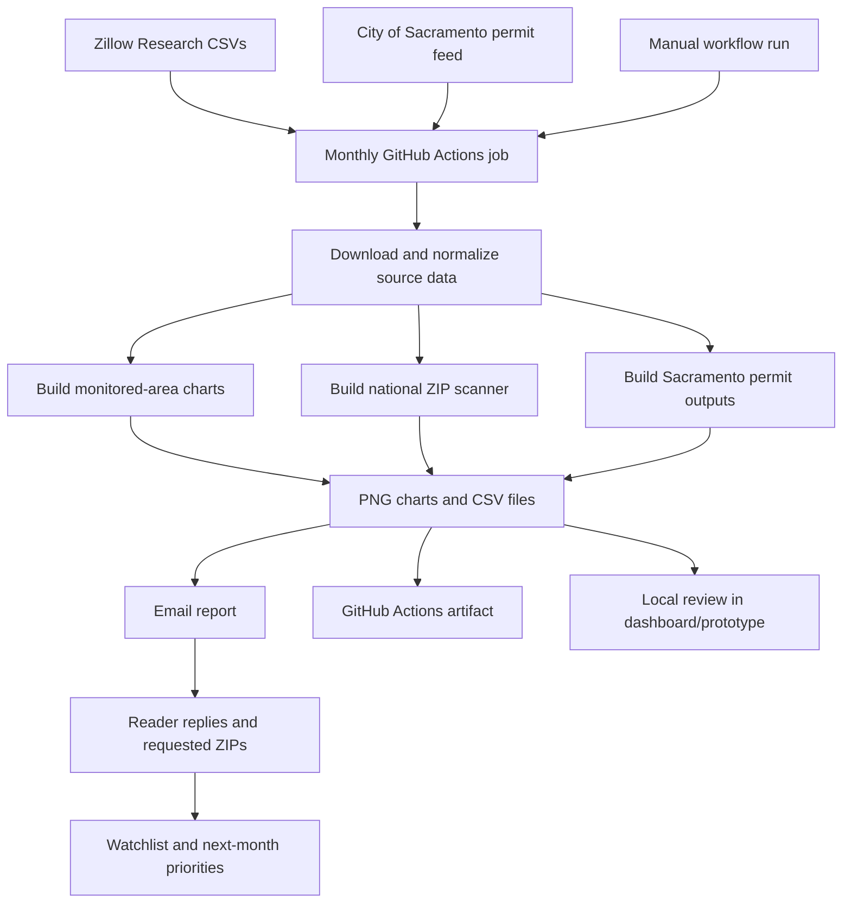
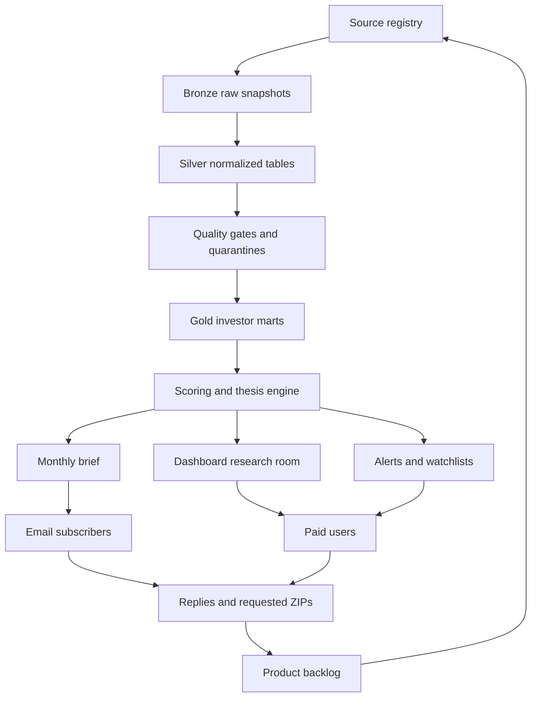

# Operating Flow

This file describes the end-to-end flow for `Sacramento Investor Radar` and future California market expansion. It is the working map for how data becomes investor intelligence.

## Flow Principle

The product is not a chart factory. It is a monthly decision-support loop:

1. Collect signals.
2. Verify signal quality.
3. Convert signals into watchlist candidates.
4. Explain the thesis and the caveats.
5. Deliver a readable brief.
6. Capture reader feedback.
7. Improve the next issue and dashboard.

## Current V1 Flow

## Target Product Flow

## Monthly Operating Cadence

### 1. Source Discovery

Maintain a source registry with:

- Source name.
- Source owner.
- Source URL.
- Geographic coverage.
- Refresh frequency.
- Expected publication lag.
- Data license or public-use notes.
- Important fields.
- Known limitations.

Priority sources:

- Zillow Research ZHVI and ZORI.
- Apartment List rent estimates and rent growth.
- City of Sacramento permits.
- Sacramento County permits when added.
- Redfin Data Center.
- Realtor.com research data.
- Census building permits.
- Population and household estimates.

### 2. Ingestion

Every run should capture:

- Raw downloaded file.
- Source URL.
- Retrieval timestamp.
- Snapshot month.
- File checksum.
- Row count.
- Column list.
- Downloader version.

Raw data must be preserved before transformation.

### 3. Normalization

Normalize into shared concepts:

- Geography: ZIP, county, metro, city, state, latitude, longitude when available.
- Time: report month, period start, period end.
- Rent: current rent, rent month-over-month, rent year-over-year, source.
- Home value: current value, value month-over-month, value year-over-year, source.
- Supply: permit count, new units, valuation, work phase, address, contractor.
- Population: population, households, housing units, density proxies.

### 4. Quality Gates

Quality gates must run before ranking:

- Freshness check.
- Schema check.
- Row count check.
- Required fields check.
- Missingness check.
- Geography validity check.
- Extreme movement check.
- Historical volatility check.
- Minimum population or market-size check.
- Cross-source consistency check when another source exists.

Rows that fail critical gates should be quarantined from top rankings. Rows that fail warning gates may remain visible with a warning.

### 5. Scoring

Scoring should be versioned and explainable.

Core ZIP opportunity score inputs:

- Gross yield proxy.
- Rent/value gap.
- Rent growth.
- Home value growth.
- Population or market-size confidence.
- Data-history confidence.
- Volatility penalty.
- New supply penalty.
- Source agreement bonus.
- Manual watchlist boost only when disclosed.

No score should be published without its inputs, version, and warning flags.

### 6. Report Production

The monthly report should generate:

- Top Sacramento ZIP watchlist.
- National ZIP scanner summary.
- Rent/value gap chart.
- Supply pressure chart.
- Renovation pulse chart.
- Contractor leaderboard.
- Low-confidence warnings.
- CSV attachments or download links.
- Plain-English thesis for highlighted ZIPs.

### 7. Delivery

Delivery channels:

- Email brief first.
- GitHub Actions artifact for generated outputs.
- Dashboard for deeper research.
- Social snippets for acquisition.

### 8. Feedback Loop

Each issue must ask for one reply:

- ZIP to watch.
- Contractor to watch.
- Permit type to separate.
- Source to add.
- Metric that was confusing.

Feedback becomes backlog only after it repeats or clearly improves investor decisions.

## Definition Of Done For A Monthly Issue

A monthly issue is done only when:

- Data freshness is known.
- Generated outputs are archived.
- Top picks include confidence and warnings.
- Permit signals separate new supply from renovation and maintenance.
- Charts are readable on mobile.
- CSV outputs are available.
- Email includes disclaimer language.
- Reader reply question is included.
- State file is updated only after a real send, not a dry run.

## Failure Flow

If a source fails:

1. Do not fabricate or backfill silently.
2. Generate the rest of the issue if possible.
3. Mark the failed source in the issue or artifact notes.
4. Exclude dependent scores if they would mislead.
5. Keep the previous month visible only as historical context, clearly labeled.

If a ranking looks suspicious:

1. Check population and row volume.
2. Check source history length.
3. Check month-over-month and year-over-year volatility.
4. Compare against another source if available.
5. Keep the row visible only with a warning, or quarantine from top picks.
