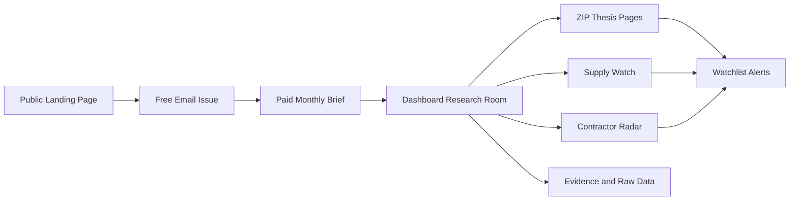

# Product Blueprint

This is the product blueprint for starting with an email list and growing into a California investor intelligence platform.

## Product Name

Sacramento Investor Radar

## Product Thesis

Most real estate tools start at the property level. This product starts one layer earlier: where should an investor focus this month, and why?

The wedge is local investor intelligence for Sacramento:

- ZIP-level rent and home-value movement.
- Rent/value dislocation.
- Population and confidence filters.
- New supply pressure.
- Renovation and ADU activity.
- Contractor movement.
- Warnings for bad or low-confidence data.

## Customer

Primary customer:

- Buy-and-hold residential rental investor in or near Sacramento.

Secondary customers:

- Small multifamily investors.
- Investor-friendly agents.
- DSCR and investor lenders.
- Property managers.
- Contractors/builders who want market context.
- Out-of-area investors evaluating Sacramento.

## Core Job To Be Done

When I am deciding where to focus my real estate research this month, help me identify ZIPs and neighborhoods with strong enough evidence to deserve deeper manual due diligence.

## Product Promise

Every month, subscribers get a short list of Sacramento areas worth investigating, with evidence, caveats, and raw data links.

## Product Boundaries

This product does:

- Build research watchlists.
- Explain market signals.
- Flag bad data and suspicious spikes.
- Track permits and contractor activity.
- Help users decide where to spend diligence time.

This product does not:

- Tell users to buy a property.
- Replace underwriting.
- Replace appraisal, legal, lending, tax, or insurance advice.
- Promise returns.
- Hide uncertainty.
- Treat one metric as truth.

## MVP

The MVP is an email-first product.

Free issue:

- Top 3 ZIPs to watch.
- One rent/value chart.
- One supply pressure signal.
- One contractor or permit highlight.
- One warning list.

Paid brief:

- Top 10 ZIPs.
- ZIP thesis notes.
- Full supply watch.
- Contractor leaderboard.
- Renovation/ADU pulse.
- CSV downloads.
- Monthly archive.

Dashboard:

- ZIP radar.
- ZIP detail page.
- Supply watch.
- Contractor radar.
- Evidence/raw data.
- Watchlist filters.

## Information Architecture

## Feature Pillars

### 1. ZIP Radar

Purpose:

Find places worth investigating.

Outputs:

- Opportunity score.
- Rent/value gap.
- Rent YoY.
- Home value YoY.
- Gross yield proxy.
- Population/confidence.
- Supply pressure.
- Warnings.

### 2. Supply Watch

Purpose:

Avoid being surprised by new rental competition.

Outputs:

- New residential permit count.
- Housing units.
- Valuation.
- Large project list.
- Units per 1,000 population when possible.
- Supply pressure label.

### 3. Reinvestment Pulse

Purpose:

Track renovation, ADU, and improvement activity that may suggest neighborhood reinvestment.

Outputs:

- Remodel/addition permits.
- ADU/conversion permits.
- Roofing/HVAC/electrical/plumbing support signals.
- Renovation valuation.
- Work phase mix.

### 4. Contractor Radar

Purpose:

Reveal who is working where and what type of work is happening.

Outputs:

- Contractor leaderboard.
- ZIP footprint.
- New construction count.
- Renovation count.
- Housing units.
- Valuation.
- Latest permit date.
- Site-level project rows.

### 5. Confidence And Warnings

Purpose:

Prevent false positives.

Outputs:

- Confidence score.
- Low population warning.
- Short history warning.
- Extreme movement warning.
- High volatility warning.
- Source disagreement warning.
- Supply pressure warning.

## Roadmap

### Phase 1: Email List

Goal:

Prove people want the analysis.

Build:

- Landing page.
- Free issue.
- Welcome email.
- Sample report.
- Reply tracking.

### Phase 2: Paid Brief

Goal:

Prove people pay for curated local intelligence.

Build:

- Full monthly issue.
- CSV attachment/downloads.
- ZIP thesis notes.
- Contractor radar.
- Supply watch.

### Phase 3: Dashboard Research Room

Goal:

Give serious users a deeper way to explore.

Build:

- Authenticated dashboard.
- ZIP detail pages.
- Watchlists.
- Archive.
- Exportable charts/tables.

### Phase 4: California Expansion

Goal:

Repeat Sacramento pattern in nearby markets.

Expansion order:

1. Sacramento County and city-level Sacramento.
2. Placer / Roseville / Rocklin.
3. San Joaquin / Stockton.
4. Yolo / Woodland / Davis.
5. Central Valley.
6. Bay Area spillover markets.
7. Inland Empire.

Expansion gate:

- Reliable permit data.
- Enough rent/value coverage.
- Population normalization.
- Local narrative that investors care about.
- Repeatable source-to-report pipeline.

## Pricing Hypothesis

Free:

- Teaser issue.

Paid Brief:

- $19/month or $149/year.

Pro Dashboard:

- $49/month or $399/year.

Team/Agent:

- $99/month for branded exports and watchlists.

## Success Metrics

First 30 days:

- 100 subscribers.
- 20 direct conversations.
- 10 replies.
- 5 beta users asking for more detail.

First 90 days:

- 500 subscribers.
- 10 paid customers.
- 3 referral partners.
- At least 4 monthly issues shipped.

## Product Risks

Risk:

Bad data creates fake opportunity.

Control:

Confidence scoring, source agreement checks, population thresholds, and warning labels.

Risk:

Too many features before demand.

Control:

Email first, dashboard second.

Risk:

Local permit feeds are incomplete or inconsistent.

Control:

Source labels, data lineage, source-specific caveats, and no silent substitution.

Risk:

Users mistake research signals for advice.

Control:

Plain disclaimer language and no buy/sell recommendations.

## Decision Rule

Every feature must answer at least one of these:

- Where should I focus?
- Why is that area interesting?
- What evidence supports it?
- What could make the signal wrong?
- What should I verify manually?
