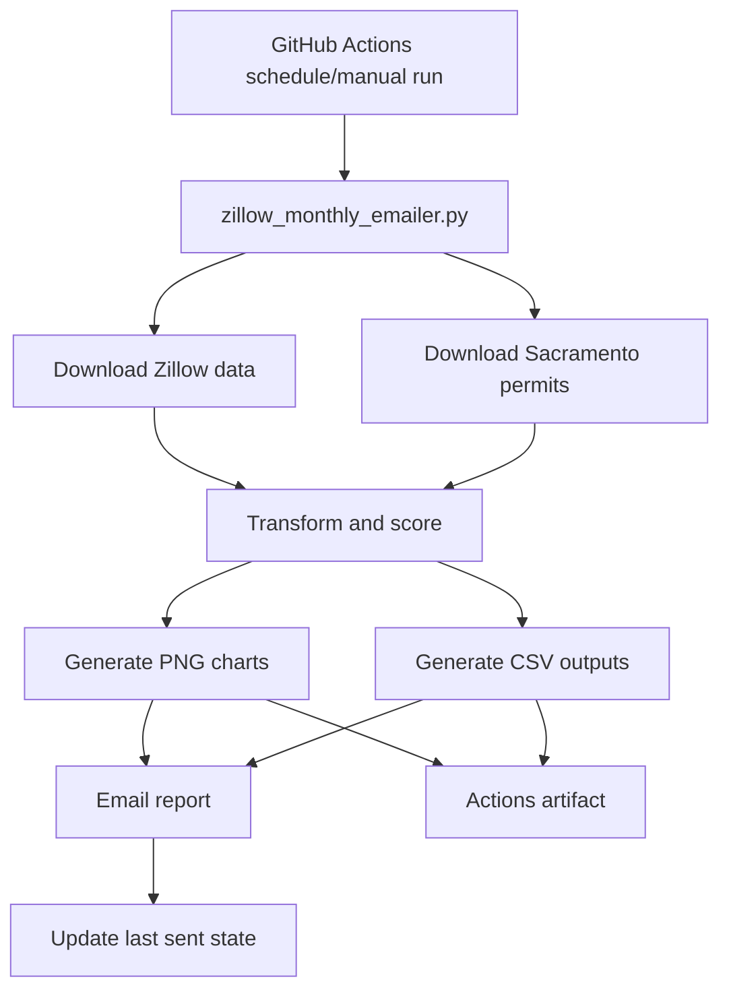
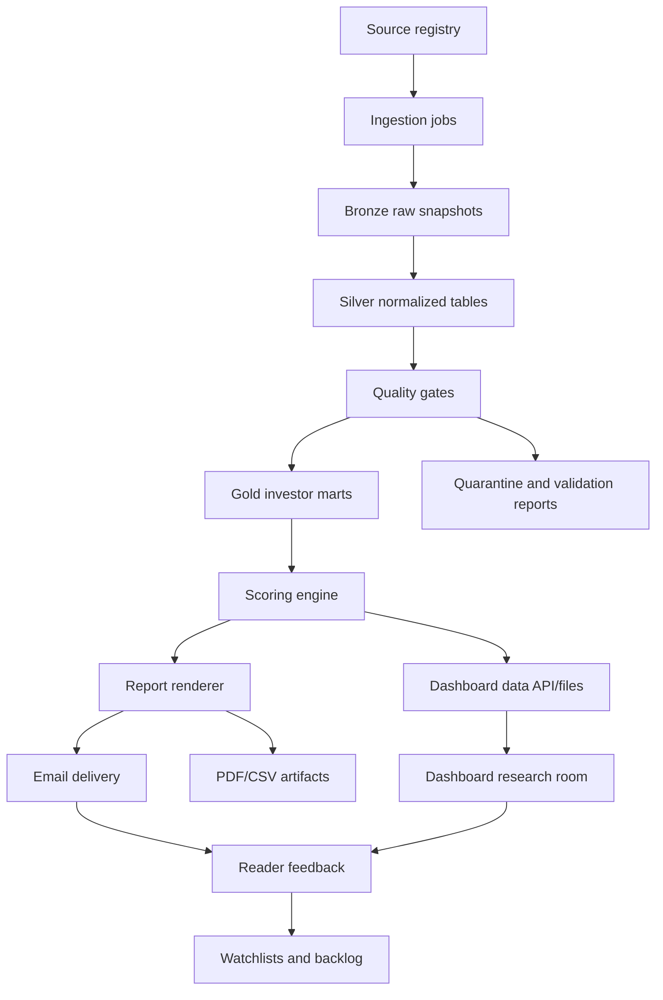

# Reference Architecture

This architecture is the target direction for `Sacramento Investor Radar`. It keeps the current monthly mailer useful while giving the project a clean path toward a durable data product.

## Architecture Standards Used

This design is grounded in established patterns:

- Medallion data architecture: raw Bronze, validated Silver, enriched Gold layers. Microsoft/Azure Databricks describes this as a recommended multi-layer pattern for improving data quality and creating a single source of truth.
- Data quality expectations: schema, row count, uniqueness, null checks, bounds checks, anomaly checks, and cross-source checks. Great Expectations documents these as core expectation categories.
- Environment-based config: credentials and deploy-specific settings should be separated from code and stored as environment variables, following Twelve-Factor App config guidance.
- Scheduled automation and secret handling: GitHub Actions supports schedules, workflow dispatch, secrets, artifacts, and pinned action versions.

Reference links:

- https://learn.microsoft.com/en-us/azure/databricks/lakehouse/medallion
- https://docs.greatexpectations.io/docs/cloud/expectations/expectations_overview/
- https://www.12factor.net/config
- https://docs.github.com/en/actions/reference/workflows-and-actions/workflow-syntax

## Current Architecture



Current strengths:

- Simple monthly automation.
- Low infrastructure cost.
- Useful generated artifacts.
- Dry-run support.
- Manual trigger support.
- Existing monitored-area logic.

Current limits:

- One large script owns ingestion, transformation, scoring, charting, and delivery.
- No formal Bronze/Silver/Gold data storage.
- Quality rules are partly embedded in scoring logic instead of being explicit gates.
- Source registry and lineage are not first-class files yet.
- Dashboard and mailer are not separated as reusable product services yet.

## Target Architecture



## Recommended Repo Structure

Target structure:

```text
zillow_monthly_emailer.py          # temporary V1 entrypoint until modularized
src/
  investor_radar/
    sources/
      registry.yml
      zillow.py
      apartment_list.py
      sacramento_permits.py
      census_permits.py
      redfin.py
      realtor.py
    ingest/
      download.py
      snapshots.py
      checksums.py
    normalize/
      geography.py
      rent.py
      values.py
      permits.py
      population.py
    quality/
      contracts.py
      expectations.py
      quarantine.py
      validation_report.py
    models/
      opportunity_score.py
      confidence_score.py
      supply_pressure.py
      reinvestment_pulse.py
    reporting/
      charts.py
      email.py
      tables.py
      narrative.py
    dashboard/
      app.py
      pages/
tests/
  unit/
  integration/
  fixtures/
data/
  bronze/
  silver/
  gold/
state/
docs/
```

For GitHub Actions, large generated datasets should be artifacts or external storage, not committed unless they are small canonical state/config files.

## Data Layers

### Bronze: Raw Snapshots

Purpose:

Preserve source truth.

Rules:

- Store raw downloaded files exactly as received.
- Never hand-edit Bronze data.
- Include source URL, snapshot month, retrieval timestamp, checksum, and downloader version.
- Keep source-specific field names.

Example:

```text
data/bronze/zillow/zori_zip/2026-04/source.csv
data/bronze/zillow/zori_zip/2026-04/manifest.json
```

### Silver: Normalized Tables

Purpose:

Create clean, consistent, joined data.

Rules:

- Standardize dates, geography, numeric fields, source names, and units.
- Keep one row per natural grain.
- Preserve source identifiers.
- Add validation status and warning flags.

Example grains:

- `zip_rent_monthly`: one ZIP per month per source.
- `zip_value_monthly`: one ZIP per month per source.
- `permit_site`: one permit/site row.
- `zip_population`: one ZIP per vintage.

### Gold: Investor Marts

Purpose:

Serve reports, dashboards, and alerts.

Rules:

- Store only business-ready outputs.
- Include score version.
- Include confidence and warnings.
- Include source lineage.
- Optimize for reading, not raw transformation.

Example marts:

- `zip_opportunity_monthly`.
- `zip_supply_pressure_monthly`.
- `zip_reinvestment_monthly`.
- `contractor_activity_monthly`.
- `dashboard_zip_thesis`.

## Data Quality Gates

Every source must have checks in these categories:

### Source Freshness

- Latest month is not older than expected.
- Publication month is known.
- Download timestamp is recorded.

### Schema

- Required columns exist.
- Important columns have expected types.
- Column count change is logged.

### Volume

- Row count is within expected range.
- Geography count is within expected range.
- Empty source files fail critical validation.

### Completeness

- Key fields are not null.
- Date columns are parseable.
- Numeric fields are parseable.

### Validity

- ZIP codes are five digits.
- State values are valid.
- Percent changes are within expected bounds unless flagged.
- Dates are not in the future unless source docs explain why.

### Anomaly

- Extreme month-over-month changes are warnings or quarantines.
- Extreme year-over-year changes require history and cross-source support.
- Suspicious spikes never become top-pick claims without a warning.

### Cross-Source Agreement

- Rent signals should compare Zillow and Apartment List when both are available.
- Supply signals should compare city/county/Census data when available.
- Source disagreement should reduce confidence, not hide the row.

## Quality Severity

Critical:

- Missing required columns.
- Empty source.
- Bad date parsing for core month.
- Broken geography keys.
- No current data for a claimed current report.

Warning:

- Extreme movement.
- Short history.
- Small market/population.
- Source disagreement.
- Missing optional fields.

Info:

- New optional columns.
- Source row count drift inside expected bounds.
- Minor missingness in non-ranking fields.

## Scoring Architecture

Scoring must be transparent and versioned.

Recommended files:

```text
src/investor_radar/models/opportunity_score.py
src/investor_radar/models/confidence_score.py
src/investor_radar/models/supply_pressure.py
src/investor_radar/models/reinvestment_pulse.py
```

Score outputs must include:

- Score value.
- Score version.
- Input columns used.
- Confidence score.
- Warning flags.
- Source coverage.
- Computed timestamp.

## Dashboard Architecture

Dashboard V1 can remain Streamlit because it is fast for local research and internal review.

Target paid product path:

- Keep analytics generation separate from UI.
- Serve dashboard from Gold marts only.
- Cache expensive data loads.
- Avoid live recomputation inside the page load path.
- Build ZIP detail pages from precomputed `dashboard_zip_thesis`.
- Add auth only when there is paid-user demand.

Dashboard pages:

- ZIP Radar.
- ZIP Thesis.
- Supply Watch.
- Contractor Radar.
- Reinvestment Pulse.
- Evidence / Raw Data.

## Email Architecture

The email is a publication product, not just a notification.

Email pipeline:

1. Generate current Gold marts.
2. Generate charts and tables.
3. Render narrative sections.
4. Attach or link CSVs.
5. Send only after quality gates pass.
6. Update state only after successful non-dry-run delivery.

State update rule:

Dry runs must never update `state/_last_sent.json`.

## Automation Architecture

GitHub Actions V1:

- Scheduled workflow checks daily.
- Job sends only when source month advances.
- Manual workflow can force send.
- Dry run generates artifacts without email.
- Secrets stay in GitHub repository secrets.

Hardening path:

- Pin action versions.
- Add a validation-only job.
- Upload validation report artifact.
- Fail before sending if critical quality gates fail.
- Keep generated artifacts for audit.
- Add a monthly smoke test.

## Security And Config

Rules:

- Secrets never live in code or docs.
- Deploy-specific config uses environment variables.
- Local `.env` files must be ignored if added later.
- Email/app credentials use least privilege.
- Public reports must avoid exposing private subscriber data.

## Observability

Every production run should output:

- Source manifest.
- Validation summary.
- Record counts by source.
- Rows quarantined by reason.
- Generated output list.
- Email send/dry-run status.
- State update status.

## Migration Plan

### Step 1: Freeze V1 Behavior

- Keep current monthly mailer running.
- Add tests around current scoring and outputs.
- Document current generated files.

### Step 2: Extract Modules

- Move source downloads into `sources/`.
- Move normalization into `normalize/`.
- Move scoring into `models/`.
- Move chart/email rendering into `reporting/`.

### Step 3: Add Data Manifests

- Store source manifests for every run.
- Add checksums and row counts.
- Add validation report artifacts.

### Step 4: Add Explicit Quality Gates

- Convert embedded warnings into reusable quality rules.
- Quarantine critical failures.
- Attach validation summary to dry-run artifacts.

### Step 5: Build Gold Marts

- Precompute dashboard/report tables.
- Make dashboard read only from Gold outputs.
- Version all scores.

### Step 6: Add Paid Product Surface

- Keep email as front door.
- Add authenticated dashboard only after paid demand.
- Add watchlists and alerts after user feedback repeats.

## Architecture Decision Rules

- Prefer boring, inspectable data files until scale forces a database.
- Prefer explicit tables over hidden transformations.
- Prefer precomputed outputs over dashboard-time recomputation.
- Prefer warnings over silent filtering.
- Prefer source lineage over clean-looking but unexplained data.
- Prefer one proven local market over shallow national expansion.
